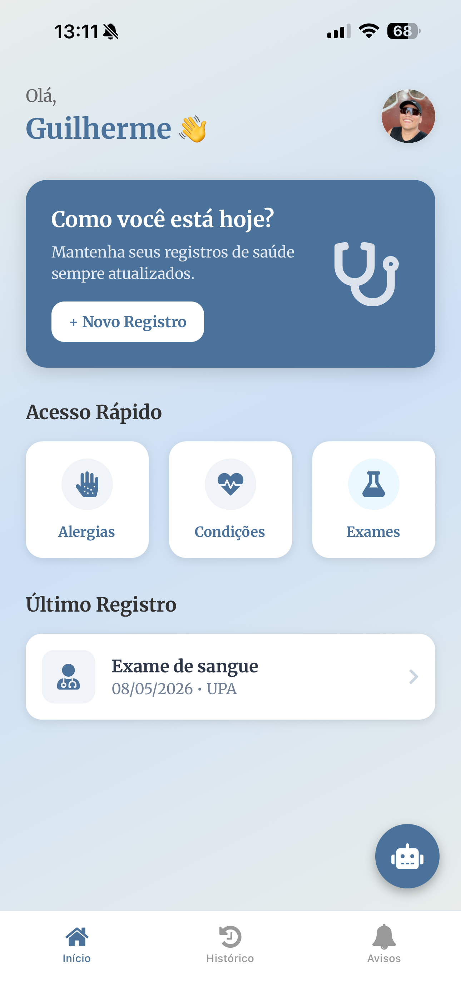
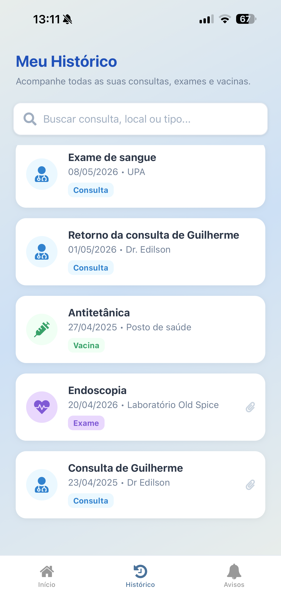
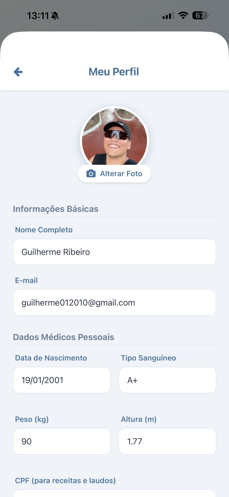

# 🩺 Heliora

> **Seu histórico médico em suas mãos.** > O Heliora é um ecossistema digital de saúde focado na centralização e simplificação de registros médicos, auxiliando pacientes a terem uma visão clara e organizada de sua jornada de cuidado.

---

## 📝 Descrição do Projeto

O Heliora nasceu da necessidade de resolver a fragmentação de informações de saúde. Muitas vezes perdemos um exame físico, esquecemos a data de uma vacina ou temos dificuldade de entender termos técnicos médicos.

Este aplicativo permite que o usuário armazene consultas, exames, vacinas e receitas em um só lugar, com segurança e praticidade, unindo tecnologia e um design humanizado para transformar a forma como você lida com sua saúde.

---

## 📸 Galeria (Screenshots)

Confira o visual moderno e acolhedor do Heliora, desenvolvido com foco na clareza e facilidade de uso:

|          Home & IA Heli           |              Histórico Médico               |            Perfil & Dados             |
| :-------------------------------: | :-----------------------------------------: | :-----------------------------------: |
|  |  |  |

---

## 🎥 Vídeo Demonstrativo

Assista ao vídeo abaixo para ver o fluxo de uso do aplicativo:

[](LINK_DO_VIDEO_AQUI)

> _Caso o link acima não funcione, clique [aqui](LINK_DO_VIDEO_AQUI) para acessar o vídeo diretamente._

---

## ✨ Principais Funcionalidades

- **Histórico Centralizado:** Armazenamento de registros por categorias (Consultas, Exames, Vacinas).
- **Heli (AI Assistant):** Uma assistente inteligente integrada para simplificar termos médicos complexos e tirar dúvidas sobre saúde.
- **Scribe AI:** Um auxílio para a gravação de consultas médicas afim de deixar salvo toda a conversa para visualização futura.
- **Acesso Rápido:** Atalhos para visualização imediata de Alergias, Condições Crônicas e Exames Recentes.
- **Anexos Inteligentes:** Suporte para visualização de arquivos e laudos médicos.
- **Design Acolhedor:** Interface moderna com tipografia **Merriweather** e transições em degradê para uma experiência humanizada.

---

## 🚀 Como Executar o Projeto (Expo Go)

Para rodar o Heliora no seu dispositivo e testar a interface:

### 1. Pré-requisitos

- Ter o **Node.js** instalado em seu computador.
- Ter o aplicativo **Expo Go** instalado no seu celular ([Android](https://play.google.com/store/apps/details?id=host.exp.exponent) ou [iOS](https://apps.apple.com/app/expo-go/id982107779)).

### 2. Instalação e Execução

```bash
# Clonar o repositório
git clone [https://github.com/seu-usuario/heliora.git](https://github.com/seu-usuario/heliora.git)

# Entrar na pasta do projeto
cd heliora

# Instalar as dependências necessárias
npm install

# Iniciar o servidor de desenvolvimento
npx expo start
```
